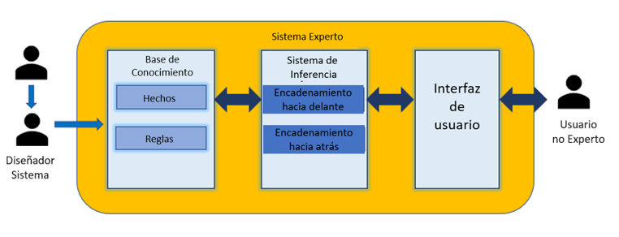

# Sistema-de-recomendación-de-viajes

## **Integrantes**
- Apaza Andaluz, Diego Francisco
- Mena Quispe, Sergio Sebastian Santos
- Pardavé Espinoza, Christian
- Condori Machaca, Saul Arturo

## **Introduccion**
El turismo ha experimentado una transformación significativa con la integración de la tecnología, lo que ha permitido a los viajeros acceder a información y recomendaciones personalizadas de manera eficiente. En este contexto, los sistemas expertos se han convertido en herramientas cruciales para facilitar la planificación de viajes, ofreciendo sugerencias basadas en las preferencias y necesidades individuales de los usuarios.

## **Objetivo**

El objetivo del sistema de recomendación de viajes es proporcionar recomendaciones personalizadas de destinos de viaje a los usuarios basándose en sus preferencias y necesidades específicas. Al hacer preguntas sobre características clave como el clima, seguridad, transporte, preferencias alimentarias, tipo de atracciones, y otros factores importantes para la experiencia de viaje, el sistema será capaz de sugerir los destinos más adecuados que se alineen con los intereses y condiciones del viajero.

## **Requisitos no funcionales**

| Requisito no funcional | Descripción |
|------------------------|-------------|
| Usabilidad             | La interfaz del sistema debe ser intuitiva y fácil de usar, permitiendo a los usuarios navegar y completar el cuestionario sin dificultades. |
| Rendimiento            | El sistema debe ser capaz de procesar las respuestas del cuestionario y generar recomendaciones rápidamente, asegurando tiempos de respuesta cortos. |
| Escalabilidad          | El sistema debe ser capaz de manejar un aumento en la cantidad de destinos sin degradar el rendimiento, permitiendo su crecimiento sin problemas. |
| Mantenibilidad         | El código del sistema debe estar bien documentado y estructurado, facilitando su mantenimiento y actualización por parte de los desarrolladores. |

## **Requisitos funcionales**

| Requisito funcional           | Descripción                                                                                                                                               |
|-------------------------------|-----------------------------------------------------------------------------------------------------------------------------------------------------------|
| Cuestionario de Preferencias  | El sistema debe presentar un cuestionario estructurado a los usuarios para recolectar información sobre sus preferencias en diversas categorías como clima, seguridad, transporte, comida, atracciones, etc. |
| Base de Datos de Destinos     | Debe existir una base de datos completa y actualizada de destinos de viaje con detalles específicos relacionados con las preguntas del cuestionario.        |
| Motor de Recomendación        | El sistema debe incluir un motor que utilice las respuestas del cuestionario para calcular las puntuaciones de los destinos y recomendar los más adecuados para el usuario. |
| Información Detallada del Destino | Para cada destino recomendado, el sistema debe proporcionar información adicional sobre actividades disponibles, atracciones principales, opciones de transporte y consejos de viaje. |

## **Estructura de Proyecto**

  

## **Alcance**

- **Perfil del Viajero**:
  
  - Recolectar información sobre las preferencias y necesidades del usuario a través de una serie de preguntas estructuradas.
  - Considerar características como clima preferido, nivel de seguridad deseado, tipo de transporte, estilo de vestimenta, interés en la fotografía, tipo de comida, atracciones deseadas, compañía de viaje, tipo de equipaje, actividades, alojamiento, y restaurantes.

- **Base de Datos de Destinos**:
  
  - Mantener una base de datos actualizada de destinos de viaje con características detalladas que corresponden a las preguntas realizadas a los usuarios.
  - Incluir información sobre clima, seguridad, transporte, comida, atracciones, alojamiento, actividades y otros aspectos relevantes.

- **Reglas de Recomendación**:
  
  - Desarrollar un conjunto de reglas que utilicen la información de la base de datos y las preferencias del usuario para realizar recomendaciones.

- **Recomendación Personalizada**:
  
  - Calcular las puntuaciones de los destinos y recomendar al usuario el destino que mejor se ajusta a sus preferencias.
  - Proporcionar información adicional sobre el destino recomendado, como actividades disponibles, atracciones principales, opciones de transporte y consejos de viaje.

## **Base de Conocimientos**
Características por destino destacadas en el survey:
- Actividad
- Atracciones
- Clima
- Restaurantes
- Seguridad
- Transporte
- Alcohol
- Biodiversidad
- Comida Saludable

## **Reglas**

En el sistema de recomendación de viajes, las reglas de recomendación se basan en las características de los destinos y las preferencias del usuario. A continuación se detallan las reglas que se implementan para diversas categorías clave, tales como actividades, atracciones, clima, restaurantes, seguridad, transporte, consumo de alcohol, biodiversidad y dieta vegetal.

### Actividades
- **Esquí y Snowboard**: Si el destino tiene resorts para esquiar o hacer snowboard, se añade una recomendación para destinos donde estas actividades son posibles.
- **Surf**: Si el destino tiene playas aptas para surfear, se añade una recomendación para destinos donde se puede practicar surf.

### Atracciones
- **Biodiversidad**: Si el destino es conocido por su biodiversidad, se añade una recomendación para destinos con gran biodiversidad.
- **Ranking de Mejor País para Visitar**: Si el destino ha sido clasificado como uno de los mejores países para visitar en encuestas, se añade una recomendación destacando este reconocimiento.

### Clima
- **Preferencias Climáticas**: Según la temperatura del destino, se determina el tipo de clima y se añade una recomendación que refleja el clima preferido por el usuario.

### Restaurantes
- **Calidad de la Comida**: Si el destino es conocido por la calidad de su comida, se añade una recomendación que refleja esta característica.

### Seguridad
- **Nivel de Seguridad**: Según el índice de criminalidad del destino, se determina el nivel de seguridad y se añade una recomendación que refleja la seguridad del destino.

### Transporte
- **Condiciones del Tráfico**: Si el destino tiene altos índices de tráfico, se añade una recomendación para destinos con información sobre las condiciones del tráfico.

### Consumo de Alcohol
- **Disponibilidad de Alcohol**: Si el destino permite el consumo de alcohol, se añade una recomendación para destinos donde el alcohol está disponible.

### Biodiversidad
- **Nivel de Biodiversidad**: Según el nivel de biodiversidad del destino, se añade una recomendación que refleja este aspecto.

### Dieta Vegetal
- **Preferencias Alimentarias**: Si el destino tiene una dieta basada en vegetales, se añade una recomendación para destinos que satisfagan esta preferencia alimentaria.

## **Tipo de Encadenamiento**

El encadenamiento hacia adelante es un método de inferencia que utiliza datos iniciales para aplicar reglas y derivar conclusiones progresivamente. Es ideal para sistemas de recomendación donde las preferencias del usuario se traducen en sugerencias específicas.

1. **Recolectar Datos del Usuario**

   - Proceso: El usuario completa un cuestionario sobre sus preferencias y necesidades de viaje.
   - Ejemplo: Clima preferido (Cálido), nivel de seguridad (Seguro), tipo de transporte (Transporte público eficiente), etc.

2. **Consulta de los Hechos Iniciales**

   - En base a las preferencias del usuario se determinará su respuesta.
   - Ejemplo: El usuario prefiere clima cálido y transporte público eficiente.

3. **Aplicar Reglas de Producción**

   - El sistema usa reglas para combinar hechos iniciales y derivar nuevos hechos.
   - Ejemplo: Si el usuario prefiere clima cálido y transporte eficiente, considerar destinos tropicales con buenas redes de transporte.

4. **Derivar Nuevos Hechos**

   - Las reglas generan nuevos hechos para refinar recomendaciones.
   - Ejemplo: Destinos tropicales con alta seguridad y buen transporte.

5. **Generar Recomendaciones**

   - El sistema crea una lista de destinos que se alinean con las preferencias del usuario.
   - Ejemplo: Singapur, Honolulu, Miami.

6. **Proporcionar Información Adicional**

   - Se ofrece información detallada de cada destino recomendado.
   - Ejemplo: Actividades en Singapur, opciones de transporte y nivel de seguridad.

## **Resultados**

## **Conclusiones**

- El sistema de recomendación de viajes basado en encadenamiento hacia adelante ofrece una solución poderosa para personalizar las sugerencias de destinos según las preferencias individuales de los usuarios. A través de la recolección de datos específicos y la aplicación de reglas de producción, el sistema puede proporcionar recomendaciones precisas y detalladas, mejorando la experiencia de planificación de viajes.
- Sin embargo, este enfoque también enfrenta varios desafíos, como la necesidad de mantener datos precisos y actualizados, manejar la complejidad del motor de recomendación, equilibrar la personalización con la generalización, y asegurar la privacidad y seguridad de los datos de los usuarios. Superar estos desafíos requerirá un enfoque cuidadoso en el diseño y desarrollo del sistema, así como una gestión continua para adaptarse a nuevas necesidades y tecnologías.
